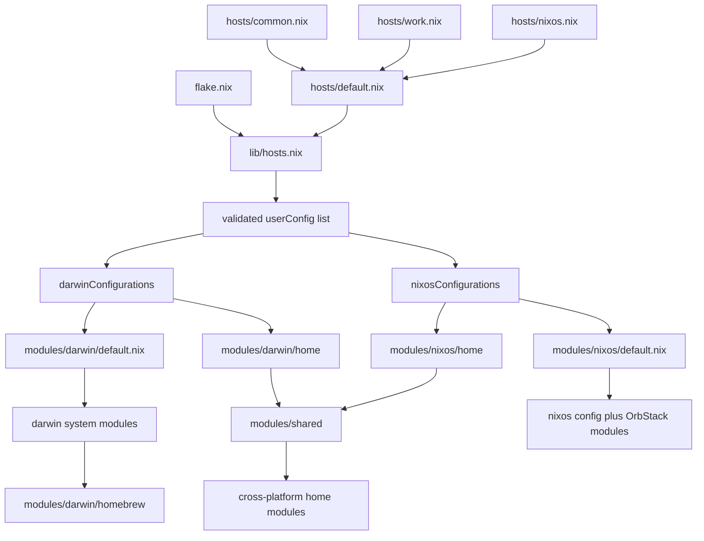
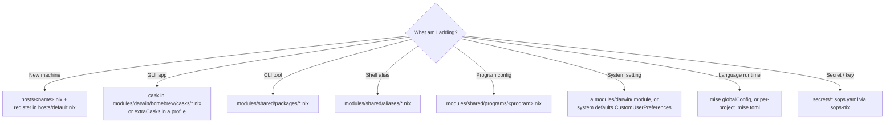

@AGENTS.md

## Architecture Diagram

Three layers: **hosts/** = machine data, **lib/** = pure logic (validation +
builders), **modules/** = config building blocks split by scope (`shared` runs
everywhere; `darwin`/`nixos` add their platform's system + `…/home/` modules).

## Where does X go?

Nested `AGENTS.md` files document the non-obvious directories: `lib/`, `pkgs/`,
`modules/nixos/orbstack/` (generated — do not edit), `modules/shared/programs/` (the
Atlassian trio), and `modules/darwin/homebrew/`. Read the one next to the files
you're editing.