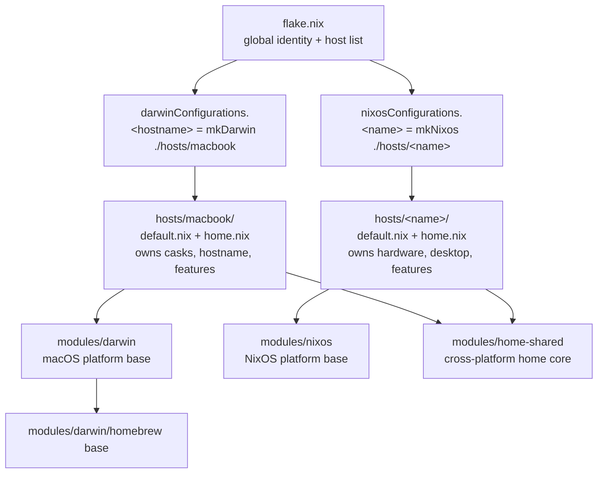
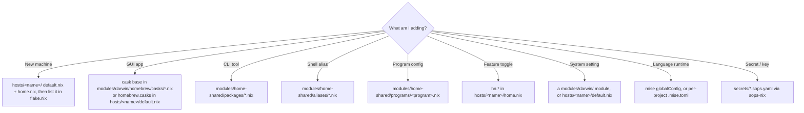

@AGENTS.md

## Architecture Diagram

Layers: **hosts/&lt;name&gt;/** — each machine OWNS its config (system `default.nix` +
`home.nix`); **lib/** — the `mkDarwin`/`mkNixos` builders; **modules/** — the reusable
layers a host pulls in (`home-shared` = cross-platform home; `darwin`/`nixos` = platform
system + `…/home/`). Identity (the single user) is global in `flake.nix`, threaded as
`userConfig`.

## Where does X go?

Nested `AGENTS.md` files document the non-obvious directories: `hosts/` (each host
owns its config), `lib/`, `pkgs/`, `modules/nixos/orbstack/` (generated — do not
edit), `modules/home-shared/programs/` (the Atlassian trio), and `modules/darwin/homebrew/`.
Read the one next to the files you're editing.