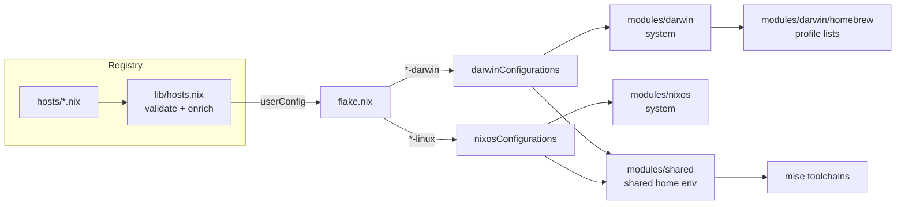
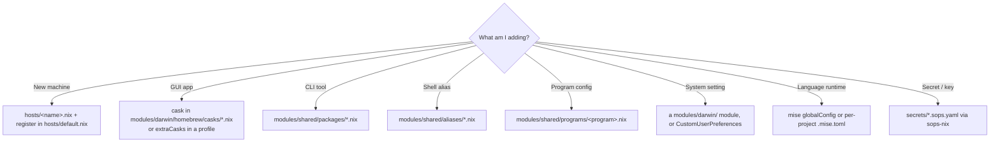

# nix-darwin configuration

macOS system configuration managed with [nix-darwin](https://github.com/nix-darwin/nix-darwin) and [home-manager](https://github.com/nix-community/home-manager).
Structure follows [mlgruby/dotfile-nix](https://github.com/mlgruby/dotfile-nix): a machine registry
(`hosts/`) plus profile-composed package lists (common base + work/personal overrides).

## Architecture

Host entries are validated into a `userConfig` list, which the flake partitions by
platform: `*-darwin` hosts become `darwinConfigurations`, `*-linux` hosts become
`nixosConfigurations`. Both share the same home-manager user environment.



### Where does X go?



## Structure

```
.
├── flake.nix                      # inputs + darwin/nixosConfigurations, packages, checks, devShells, apps, formatter
├── hosts/                         # LAYER 1 · DATA — one file per machine
│   ├── default.nix                # registry: common + host list
│   ├── common.nix                 # shared identity
│   ├── work.nix                   # KOD work Mac
│   └── nixos.nix                  # OrbStack dev VM
├── hosts.example.nix              # host template
├── lib/                           # LAYER 2 · LOGIC (pure)
│   ├── hosts.nix                  # validation & enrichment (userConfig)
│   ├── mk-system.nix              # mkDarwin/mkNixos builders
│   └── mk-home.nix                # shared home-manager wiring
├── modules/                       # LAYER 3 · BUILDING BLOCKS (by scope)
│   ├── shared/                    # cross-platform home-manager ("shared core")
│   │   ├── default.nix            # shared module imports
│   │   ├── features.nix           # hn.* feature registry (per-host toggles)
│   │   ├── files.nix              # static dotfiles (home.file / xdg.configFile)
│   │   ├── programs/              # per-program: git, ssh, zsh, mise, atlassian-*, ...
│   │   ├── packages/              # categorized CLI packages
│   │   ├── aliases/               # shell aliases split by domain
│   │   └── scripts/               # shell scripts installed via home-manager
│   ├── darwin/                    # macOS SYSTEM (nix-darwin)
│   │   ├── default.nix            # system entry point
│   │   ├── configuration.nix nix-settings.nix misc-system.nix security.nix …
│   │   ├── homebrew/              # nix-homebrew wiring + taps/brews/casks + profiles
│   │   └── home/                  # macOS-only home modules (default-browser, hammerspoon)
│   └── nixos/                     # Linux SYSTEM (NixOS)
│       ├── default.nix  configuration.nix
│       ├── orbstack/              # OrbStack-generated guest config (do NOT edit)
│       └── home/                  # linux-only home modules
├── pkgs/                          # custom packages, exported as flake packages + checks
├── shells/                        # dev shells: nix develop .#default|atlassian|node|python
├── secrets/                       # sops-nix scaffold (inert until features.secrets = true)
├── treefmt.nix / statix.toml      # nix fmt (treefmt) + statix config
├── .github/workflows/check.yml    # CI: format, lint, eval hosts, build packages
├── .claude/commands/              # repo slash commands (/build /rebuild /add-host /add-cask)
├── scripts/bootstrap.sh           # fresh-machine bootstrap
└── docs/                          # onboarding, architecture, runbooks/, refactor-plan
```

`nix run .#build-switch` builds + switches the current machine's config.

## Rebuild

```
sudo darwin-rebuild switch --flake .
# or, after the first switch: `rebuild` / `rebuild2` (nh, with diff)
```

Note: flakes only see files tracked by git — after adding new files, run
`git add -A` before rebuilding.

## Adding things

- **A machine**: add `hosts/<name>.nix` and register it in `hosts/default.nix`
  (see [docs/runbooks/add-a-host.md](docs/runbooks/add-a-host.md)).
- **A GUI app**: add its cask to `modules/darwin/homebrew/casks/*.nix` (all
  profiles) or `extraCasks` in `modules/darwin/homebrew/profiles/<profile>.nix` (one profile).
- **A CLI tool**: add to `modules/shared/packages/*.nix`.
- **An alias**: add to `modules/shared/aliases/*.nix`.
- **A per-host feature toggle**: add it to `modules/shared/features.nix`
  (`hn.*`) and gate the module with `lib.mkIf`; set it per machine via
  `features = { … }` in `hosts/<name>.nix`.
- **A dev shell**: add `shells/<name>.nix` and wire it in `flake.nix` devShells.

## Checks & formatting

```
nix fmt              # treefmt (nixfmt), skips generated trees
nix run nixpkgs#statix -- check .   # lint (config in statix.toml)
nix build .#checks.aarch64-darwin.raycast-beta   # validate a pinned package
```

CI (`.github/workflows/check.yml`) runs format + lint + evaluates every host +
builds the darwin packages on each push/PR.
