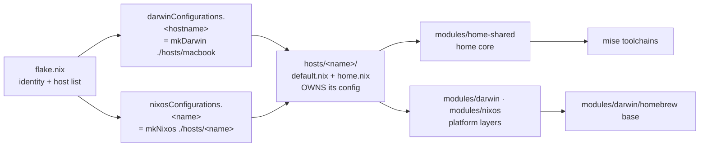
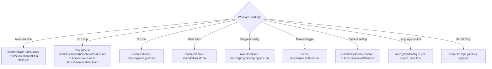

# nix-darwin configuration

macOS + NixOS system configuration managed with [nix-darwin](https://github.com/nix-darwin/nix-darwin)
and [home-manager](https://github.com/nix-community/home-manager). Each machine **owns its config**
under `hosts/<name>/`, composing reusable layers (`modules/{shared,darwin,nixos}`).

## Architecture

`flake.nix` defines the global identity (one user) and lists each host, mapping it to
its directory. A host's `default.nix` (system) + `home.nix` (home) own everything
machine-specific and pull in the shared + platform layers.



### Where does X go?



## Structure

```
.
├── flake.nix                      # global identity + explicit host list; packages/checks/devShells/apps/formatter
├── hosts/                         # EACH MACHINE OWNS ITS CONFIG (one dir per host)
│   ├── macbook/                   # work Mac (KOD-ADMINs-MacBook-Pro)
│   │   ├── default.nix            #   system: hostPlatform, hostname, its homebrew.casks
│   │   └── home.nix               #   home: its hn.* toggles + host-only user config
│   ├── nixos/                     # OrbStack VM (default.nix imports orbstack; home.nix)
│   └── nixos-desktop/             # GUI VM (default.nix + home.nix + hardware-configuration.nix)
├── lib/                           # the builders (pure)
│   ├── mk-system.nix              # mkDarwin/mkNixos: hostPath -> platform + host + home
│   └── mk-home.nix                # shared home-manager wiring + per-host home.nix
├── modules/                       # REUSABLE LAYERS a host imports
│   ├── home-shared/                    # cross-platform home-manager ("shared core")
│   │   ├── default.nix  features.nix  files.nix
│   │   ├── programs/              # per-program: git, ssh, zsh, mise, atlassian-*, ...
│   │   ├── packages/  aliases/  scripts/
│   ├── darwin/                    # macOS platform layer (nix-darwin)
│   │   ├── default.nix  configuration.nix  nix-settings.nix  security.nix  …
│   │   ├── homebrew/              # nix-homebrew wiring + shared taps/brews/casks base
│   │   └── home/                  # macOS-only home modules (default-browser, hammerspoon, conda)
│   └── nixos/                     # NixOS platform layer
│       ├── default.nix  configuration.nix
│       ├── desktop/               # reusable GNOME + VM guest-tools layer
│       ├── orbstack/              # OrbStack-generated guest config (do NOT edit)
│       └── home/                  # linux-only home modules
├── pkgs/                          # custom packages, exported as flake packages + checks
├── shells/                        # dev shells: nix develop .#default|atlassian|node|python
├── secrets/                       # sops-nix scaffold (inert until features.secrets = true)
├── treefmt.nix / statix.toml      # nix fmt (treefmt) + statix config
├── .github/workflows/check.yml    # CI: format, lint, eval hosts, build packages
├── .claude/commands/              # repo slash commands (/build /rebuild /add-host /add-cask)
├── scripts/bootstrap.sh           # fresh-machine bootstrap
└── docs/                          # onboarding, architecture, runbooks/, refactor-plan
```

`nix run .#build-switch` builds + switches the current machine's config.

## Rebuild

```
sudo darwin-rebuild switch --flake .
# or, after the first switch: `rebuild` / `rebuild2` (nh, with diff)
```

Note: flakes only see files tracked by git — after adding new files, run
`git add -A` before rebuilding.

## Adding things

- **A machine**: create `hosts/<name>/{default.nix,home.nix}` and list it in
  `flake.nix` (see [docs/runbooks/add-a-host.md](docs/runbooks/add-a-host.md)).
- **A GUI app**: add its cask to `modules/darwin/homebrew/casks/*.nix` (all
  hosts) or `homebrew.casks` in `hosts/<name>/default.nix` (one host).
- **A CLI tool**: add to `modules/home-shared/packages/*.nix`.
- **An alias**: add to `modules/home-shared/aliases/*.nix`.
- **A feature toggle for one host**: enable it in `hosts/<name>/home.nix`
  (`hn.<feature>.enable = true;`); options are declared in `modules/home-shared/features.nix`.
- **A dev shell**: add `shells/<name>.nix` and wire it in `flake.nix` devShells.

## Checks & formatting

```
nix fmt              # treefmt (nixfmt), skips generated trees
nix run nixpkgs#statix -- check .   # lint (config in statix.toml)
nix build .#checks.aarch64-darwin.raycast-beta   # validate a pinned package
```

CI (`.github/workflows/check.yml`) runs format + lint + evaluates every host +
builds the darwin packages on each push/PR.
