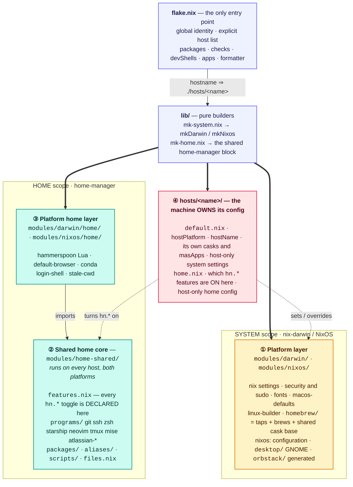
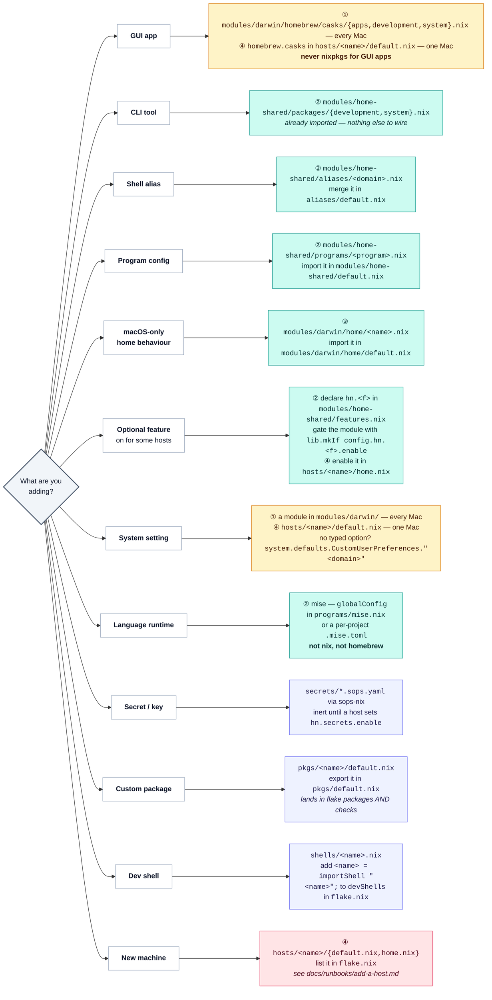
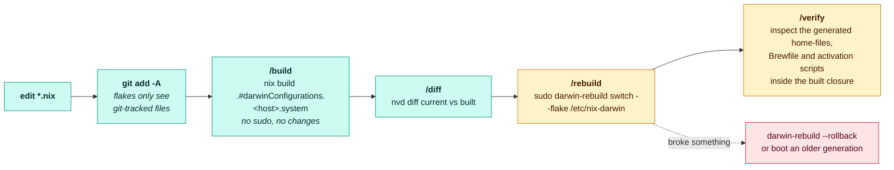

# nix-darwin configuration

macOS + NixOS system configuration built on [nix-darwin](https://github.com/nix-darwin/nix-darwin)
and [home-manager](https://github.com/nix-community/home-manager), pinned with Nix Flakes.

The organising rule: **each machine owns its config** under `hosts/<name>/`, and everything
reusable lives in layers under `modules/` that the machine composes. There is no "global config
with per-host exceptions" — a host is the only place a per-machine decision is allowed to live.

The repo is checked out at `/etc/nix-darwin` (user-owned, so no sudo to edit); inside the OrbStack
VM the same checkout is visible at `/private/etc/nix-darwin`.

## Hosts

| directory | attr name in `flake.nix` (= hostname) | platform | what it is |
|---|---|---|---|
| `hosts/macbook/` | `KOD-ADMINs-MacBook-Pro` | `aarch64-darwin` | Apple Silicon work Mac, user `kod_admin` |
| `hosts/nixos/` | `nixos` | `aarch64-linux` | headless OrbStack dev VM (imports `modules/nixos/orbstack/`) |
| `hosts/nixos-desktop/` | `nixos-desktop` | `x86_64-linux` | GNOME VM under VirtualBox (imports `modules/nixos/desktop/`) |

---

## Layers & how a configuration is assembled

`flake.nix` holds two things only: the **global identity** (one user, threaded to every module as
`userConfig`) and an **explicit host list** mapping a hostname to a directory. Everything else is
composition, done by the pure builders in `lib/`.

Each numbered layer below is a directory, and each box lists what belongs in it.


```mermaid
flowchart TB
  F["<b>flake.nix</b> — the only entry point<br/>global identity · explicit host list<br/>packages · checks · devShells · apps · formatter"]
  MS["<b>lib/</b> — pure builders<br/>mk-system.nix → mkDarwin / mkNixos<br/>mk-home.nix → the shared home-manager block"]
  F -->|"hostname ⇒ ./hosts/&lt;name&gt;"| MS

  subgraph sys["SYSTEM scope · nix-darwin / NixOS"]
    P1["<b>① Platform layer</b><br/><code>modules/darwin/</code> · <code>modules/nixos/</code><br/><br/>nix settings · security and sudo · fonts · macos-defaults<br/>linux-builder · <code>homebrew/</code> = taps + brews + shared cask base<br/>nixos: configuration · <code>desktop/</code> GNOME · <code>orbstack/</code> generated"]
  end

  subgraph home["HOME scope · home-manager"]
    P3["<b>③ Platform home layer</b><br/><code>modules/darwin/home/</code> · <code>modules/nixos/home/</code><br/><br/>hammerspoon Lua · default-browser · conda<br/>login-shell · stale-cwd"]
    P2["<b>② Shared home core</b> — <code>modules/home-shared/</code><br/><i>runs on every host, both platforms</i><br/><br/><code>features.nix</code> — every <code>hn.*</code> toggle is DECLARED here<br/><code>programs/</code> git ssh zsh starship neovim tmux mise atlassian-*<br/><code>packages/</code> · <code>aliases/</code> · <code>scripts/</code> · <code>files.nix</code>"]
    P3 -->|imports| P2
  end

  H["<b>④ hosts/&lt;name&gt;/ — the machine OWNS its config</b><br/><br/><code>default.nix</code> · hostPlatform · hostName · its own casks and masApps · host-only system settings<br/><code>home.nix</code> · which <code>hn.*</code> features are ON here · host-only home config"]

  MS ==> P1
  MS ==> P3
  MS ==> H
  H -.->|"sets / overrides"| P1
  H -.->|"turns hn.* on"| P2

  classDef l0 fill:#eef2ff,stroke:#6366f1,stroke-width:1.5px,color:#1e1b4b
  classDef l1 fill:#fef3c7,stroke:#d97706,stroke-width:1.5px,color:#451a03
  classDef l2 fill:#ccfbf1,stroke:#0d9488,stroke-width:1.5px,color:#042f2e
  classDef l3 fill:#ffe4e6,stroke:#e11d48,stroke-width:1.5px,color:#4c0519
  class F,MS l0
  class P1 l1
  class P2,P3 l2
  class H l3
```

Reading the arrows: solid `==>` are the module lists the builder assembles, `-->` is a real `imports`
edge, and dotted are the merge relations that make the host authoritative. All layers are merged by
the Nix module system rather than applied in sequence — a shared module marks a value `lib.mkDefault`
so a host can simply assign over it.

**Why the two scopes are separate:** system scope needs `sudo` and touches the machine
(`/etc`, LaunchDaemons, Homebrew, macOS defaults); home scope runs as the user and produces
`~/.zshrc`, `~/.hammerspoon/`, `~/.gitconfig`. `modules/home-shared/` is deliberately
platform-agnostic so the Mac and both Linux VMs get the identical shell, git and editor setup.

---

## Where does X go?

Each leaf is the file to create or edit, plus the second file you must wire it into.


```mermaid
flowchart LR
  Q{"What are you<br/>adding?"}

  Q --> A1["<b>GUI app</b>"]
  A1 --> A1p["① <code>modules/darwin/homebrew/casks/{apps,development,system}.nix</code> — every Mac<br/>④ <code>homebrew.casks</code> in <code>hosts/&lt;name&gt;/default.nix</code> — one Mac<br/><b>never nixpkgs for GUI apps</b>"]

  Q --> A2["<b>CLI tool</b>"]
  A2 --> A2p["② <code>modules/home-shared/packages/{development,system}.nix</code><br/><i>already imported — nothing else to wire</i>"]

  Q --> A3["<b>Shell alias</b>"]
  A3 --> A3p["② <code>modules/home-shared/aliases/&lt;domain&gt;.nix</code><br/>merge it in <code>aliases/default.nix</code>"]

  Q --> A4["<b>Program config</b>"]
  A4 --> A4p["② <code>modules/home-shared/programs/&lt;program&gt;.nix</code><br/>import it in <code>modules/home-shared/default.nix</code>"]

  Q --> A5["<b>macOS-only<br/>home behaviour</b>"]
  A5 --> A5p["③ <code>modules/darwin/home/&lt;name&gt;.nix</code><br/>import it in <code>modules/darwin/home/default.nix</code>"]

  Q --> A6["<b>Optional feature</b><br/>on for some hosts"]
  A6 --> A6p["② declare <code>hn.&lt;f&gt;</code> in <code>modules/home-shared/features.nix</code><br/>gate the module with <code>lib.mkIf config.hn.&lt;f&gt;.enable</code><br/>④ enable it in <code>hosts/&lt;name&gt;/home.nix</code>"]

  Q --> A7["<b>System setting</b>"]
  A7 --> A7p["① a module in <code>modules/darwin/</code> — every Mac<br/>④ <code>hosts/&lt;name&gt;/default.nix</code> — one Mac<br/>no typed option? <code>system.defaults.CustomUserPreferences.&quot;&lt;domain&gt;&quot;</code>"]

  Q --> A8["<b>Language runtime</b>"]
  A8 --> A8p["② mise — <code>globalConfig</code> in <code>programs/mise.nix</code><br/>or a per-project <code>.mise.toml</code><br/><b>not nix, not homebrew</b>"]

  Q --> A9["<b>Secret / key</b>"]
  A9 --> A9p["<code>secrets/*.sops.yaml</code> via sops-nix<br/>inert until a host sets <code>hn.secrets.enable</code>"]

  Q --> A10["<b>Custom package</b>"]
  A10 --> A10p["<code>pkgs/&lt;name&gt;/default.nix</code><br/>export it in <code>pkgs/default.nix</code><br/><i>lands in flake packages AND checks</i>"]

  Q --> A11["<b>Dev shell</b>"]
  A11 --> A11p["<code>shells/&lt;name&gt;.nix</code><br/>add <code>&lt;name&gt; = importShell &quot;&lt;name&gt;&quot;;</code> to <code>devShells</code> in <code>flake.nix</code>"]

  Q --> A12["<b>New machine</b>"]
  A12 --> A12p["④ <code>hosts/&lt;name&gt;/{default.nix,home.nix}</code><br/>list it in <code>flake.nix</code><br/><i>see docs/runbooks/add-a-host.md</i>"]

  classDef q fill:#f1f5f9,stroke:#475569,stroke-width:2px,color:#0f172a
  classDef k fill:#ffffff,stroke:#94a3b8,color:#0f172a
  classDef l1 fill:#fef3c7,stroke:#d97706,color:#451a03
  classDef l2 fill:#ccfbf1,stroke:#0d9488,color:#042f2e
  classDef l3 fill:#ffe4e6,stroke:#e11d48,color:#4c0519
  classDef l0 fill:#eef2ff,stroke:#6366f1,color:#1e1b4b
  class Q q
  class A1,A2,A3,A4,A5,A6,A7,A8,A9,A10,A11,A12 k
  class A1p,A7p l1
  class A2p,A3p,A4p,A5p,A6p,A8p l2
  class A12p l3
  class A9p,A10p,A11p l0
```

### Feature registry (`hn.*`)

Options are declared in `modules/home-shared/features.nix`; a host opts in from its own
`hosts/<name>/home.nix`. Consuming modules are gated with `lib.mkIf config.hn.<f>.enable`, so an
off feature contributes nothing to the closure.

| option | default | what it turns on |
|---|---|---|
| `hn.hammerspoon` | on (macOS) | Lua automation; sub-toggles `clipboardSounds`, `volumeWatch`, `urlRouter`, `autoLaunch`, `autoReload` |
| `hn.defaultBrowser` | on (macOS) | sets the per-user http/https handler on activation |
| `hn.atlassian` | off | Atlassian Plugin SDK + branch-based mise/Java switching |
| `hn.homelabTunnel` | off | socat port-forward aliases to the homelab over Tailscale |
| `hn.remoteDocker` | off | Docker CLI with no local engine + remote contexts over SSH |
| `hn.staleCwdRecovery` | off | repair a shell whose cwd vanished when a volume was unplugged |
| `hn.secrets` | off | sops-nix age-encrypted secrets |
| `hn.atuin` | off | Atuin shell history (Ctrl-R search, optional sync) |

`nix.linux-builder` is on by default on darwin (`modules/darwin/linux-builder.nix`); `hosts/macbook`
disables it.

---

## Edit → verify → apply


```mermaid
flowchart LR
  E["<b>edit *.nix</b>"] --> GA["<b>git add -A</b><br/><i>flakes only see<br/>git-tracked files</i>"]
  GA --> B["<b>/build</b><br/>nix build .#darwinConfigurations.&lt;host&gt;.system<br/><i>no sudo, no changes</i>"]
  B --> D["<b>/diff</b><br/>nvd diff current vs built"]
  D --> S["<b>/rebuild</b><br/>sudo darwin-rebuild switch --flake /etc/nix-darwin"]
  S --> V["<b>/verify</b><br/>inspect the generated home-files,<br/>Brewfile and activation scripts<br/>inside the built closure"]
  S -.->|"broke something"| R["darwin-rebuild --rollback<br/>or boot an older generation"]

  classDef ok fill:#ccfbf1,stroke:#0d9488,color:#042f2e
  classDef warn fill:#fef3c7,stroke:#d97706,color:#451a03
  classDef bad fill:#ffe4e6,stroke:#e11d48,color:#4c0519
  class E,GA,B,D ok
  class S,V warn
  class R bad
```

The `/…` names are repo slash commands in `.claude/commands/` (`build`, `diff`, `rebuild`, `clean`,
`update`, `add-host`, `add-cask`) plus the `verify` skill in `.claude/skills/`. The raw commands:

```bash
# build only — always do this before switching
nix build .#darwinConfigurations.KOD-ADMINs-MacBook-Pro.system

# apply (what the `rebuild` zsh alias runs)
sudo darwin-rebuild switch --flake /etc/nix-darwin

# either platform, picks the host by hostname
nix run .#build-switch

# NixOS: evaluate from the Mac, apply inside the VM
nix build .#nixosConfigurations.nixos.config.system.build.toplevel --dry-run
orb -m nixos sudo nixos-rebuild switch --flake /private/etc/nix-darwin#nixos
```

Editing this repo: `nix develop` (nixfmt, statix, deadnix, nil), then `nix fmt`, `nix flake check`.
CI (`.github/workflows/check.yml`) runs format + lint, evaluates every host, and builds the
darwin packages on each push/PR.

---

## Directory map

```
.
├── flake.nix                     # ① identity + explicit host list; packages/checks/devShells/apps/formatter
├── flake.lock                    #   tracked — builds are pure, never pass --impure
│
├── hosts/                        # ④ EACH MACHINE OWNS ITS CONFIG
│   ├── macbook/                  #   work Mac → attr KOD-ADMINs-MacBook-Pro
│   │   ├── default.nix           #     system: hostPlatform, hostName, its casks/masApps
│   │   └── home.nix              #     home:   its hn.* toggles + host-only user config
│   ├── nixos/                    #   OrbStack VM — default.nix imports modules/nixos/orbstack
│   └── nixos-desktop/            #   GNOME VM — + generated hardware-configuration.nix
│
├── lib/                          # pure builders (no host knowledge beyond the path)
│   ├── mk-system.nix             #   mkDarwin / mkNixos: hostPath → platform + host + home
│   └── mk-home.nix               #   the shared home-manager block (useGlobalPkgs, stateVersion)
│
├── modules/                      # THE REUSABLE LAYERS
│   ├── home-shared/              # ② cross-platform home core — runs on EVERY host
│   │   ├── features.nix          #     hn.* option declarations (the feature registry)
│   │   ├── default.nix           #     imports everything below
│   │   ├── files.nix             #     static dotfiles (home.file / xdg.configFile)
│   │   ├── programs/             #     git ssh zsh starship neovim tmux direnv fzf eza zoxide
│   │   │                         #       nh atuin docker mise maven atlassian-sdk atlassian-mise
│   │   ├── packages/             #     development.nix + system.nix (CLI tools from nix)
│   │   ├── aliases/              #     per-domain alias files, merged in aliases/default.nix
│   │   └── scripts/              #     shipped shell scripts (atlas-mise-*)
│   │
│   ├── darwin/                   # ① macOS platform layer (nix-darwin)
│   │   ├── default.nix           #     imports the siblings below + homebrew/
│   │   ├── configuration.nix  nix-settings.nix  security.nix  misc-system.nix
│   │   ├── fonts.nix  macos-defaults.nix  linux-builder.nix
│   │   ├── homebrew/             #     nix-homebrew wiring + shared taps/brews/casks base
│   │   └── home/                 # ③ macOS-only home modules (+ hammerspoon/*.lua)
│   │
│   └── nixos/                    # ① Linux platform layer
│       ├── default.nix  configuration.nix
│       ├── desktop/              #     reusable GNOME + VM guest-tools layer
│       ├── orbstack/             #     GENERATED by OrbStack — do NOT hand-edit
│       └── home/                 # ③ Linux-only home modules
│
├── pkgs/                         # custom packages → flake `packages` AND `checks`
│                                 #   atlassian-plugin-sdk-{8_2_7,9_1_1}, claude-desktop, opencode-desktop
├── shells/                       # nix develop .#default|atlassian|node|python
├── secrets/                      # sops-nix scaffold; inert until hn.secrets.enable
├── scripts/bootstrap.sh          # fresh-machine bootstrap (Xcode CLT, Homebrew, Nix, first switch)
├── treefmt.nix  statix.toml      # nix fmt (treefmt/nixfmt) + statix lint config
├── .github/workflows/check.yml   # CI: format, lint, eval every host, build packages
├── .claude/                      # commands/ (repo slash commands) + skills/verify
├── AGENTS.md  CLAUDE.md          # agent guidance (CLAUDE.md just includes AGENTS.md)
└── docs/                         # onboarding, architecture, runbooks/
```

Non-obvious directories carry their own nested `AGENTS.md`: `hosts/`, `lib/`, `pkgs/`,
`modules/nixos/orbstack/`, `modules/home-shared/programs/`, `modules/darwin/homebrew/`.
**Read the one next to the files you are editing.**

---

## Conventions & gotchas

- **Flakes only see git-tracked files.** `git add -A` new files before building, or they are
  invisible and the error will not say so.
- **`flake.lock` is tracked and builds are pure** — never pass `--impure`. Run `darwin-rebuild` as
  your own user (not from a root shell) so the lock file does not become root-owned.
- **`homebrew.onActivation.cleanup = "zap"`** — any cask or brew not declared in nix is uninstalled
  on the next switch. Adding an app by hand does not survive.
- **User identity lives in `hosts/`**, threaded to modules as `userConfig`. Never hardcode a
  username or email in a module.
- **stateVersion is intentionally pinned** (`system.stateVersion = 4`,
  `home.stateVersion = "26.05"`). These record install-time defaults; do not "upgrade" them.
- **Verify by building**, and for home-manager changes inspect the generated files inside the built
  `home-manager-generation` / `home-manager-files` store path rather than trusting the nix source.
- **OrbStack VM:** sshd stays disabled — OrbStack provides access (`orb -m nixos`, `ssh nixos@orb`).
  Only `modules/nixos/configuration.nix` is hand-maintained; `modules/nixos/orbstack/` is generated.
- Comments in this repo are in English.

### macOS specifics

- **Some `system.defaults` need a logout or restart** (Dock, Finder, WindowManager, input sources).
  A rebuild writes the plist, but a running process only rereads it at login.
- **The first switch triggers one-time GUI permission prompts** — default-browser dialog, Input
  Source Pro accessibility, App Management. Approve them manually; they cannot be granted
  declaratively. Touch ID for sudo works from the second switch on.
- **Input methods** (ABC + Vietnamese Telex + Japanese Kotoeri) are configured manually. Do **not**
  declare `AppleEnabledInputSources` via `CustomUserPreferences` — it replaces the whole list and
  wipes them.
- **Keyboard type (ANSI/ISO/JIS) is not a nix setting.** Fix `§`/`±` vs `` ` ``/`~` confusion in the
  macOS Keyboard Setup Assistant, not with `hidutil` remaps.

### Dev toolchains

Language runtimes come from **mise** (`modules/home-shared/programs/mise.nix`), not nix or Homebrew:
Node LTS + pnpm 11 globally; Java 25 (default), 17 and 8 installed, picked per project in
`.mise.toml`. Python and data science use the `miniconda` cask, with conda init going through
`programs.zsh` — never `conda init`.

The **Atlassian Plugin SDK** is nix-pinned at stable paths (Homebrew's tap is broken — never use
it): `~/.local/share/atlassian-plugin-sdk/{8.2.7,9.1.1}/bin`. Pair 8.2.7 with Java 8 (`zulu-8`;
Temurin has no arm64 JDK 8) and 9.1.1 with Java 17 (`temurin-17`). `atlas-mise-enable` installs git
hooks that regenerate a gitignored `.mise.local.toml` per branch. Full details in
[`modules/home-shared/programs/AGENTS.md`](modules/home-shared/programs/AGENTS.md).

---

## Docs

| doc | what it covers |
|---|---|
| [docs/onboarding.md](docs/onboarding.md) | fresh machine, daily commands, manual steps, troubleshooting |
| [docs/architecture.md](docs/architecture.md) | data flow, the layers, why this shape |
| [docs/runbooks/rebuild-and-rollback.md](docs/runbooks/rebuild-and-rollback.md) | applying changes and backing them out |
| [docs/runbooks/add-a-host.md](docs/runbooks/add-a-host.md) | adding a machine |
| [docs/runbooks/add-nixos-host.md](docs/runbooks/add-nixos-host.md) | adding a Linux host / VM |
| [docs/runbooks/add-a-package.md](docs/runbooks/add-a-package.md) | GUI app, CLI tool, or runtime |
| [docs/runbooks/secrets.md](docs/runbooks/secrets.md) | sops-nix setup and key handling |
| [docs/refactor-plan.md](docs/refactor-plan.md) | the plan this layout came from (historical) |
