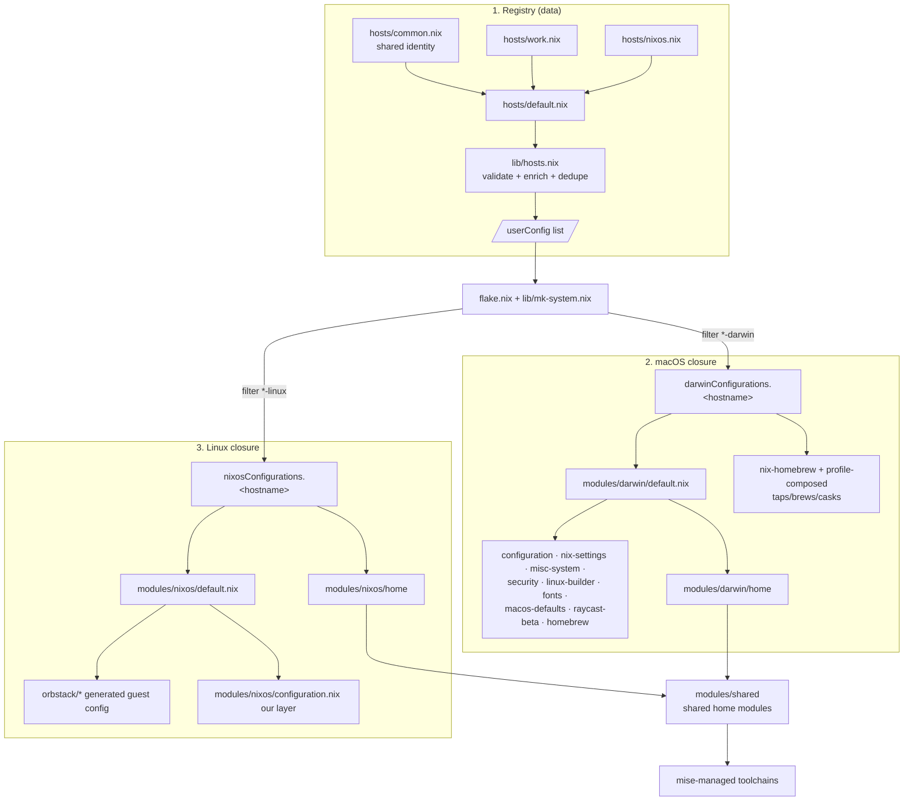

# Architecture

How a `darwin-rebuild` / `nixos-rebuild` turns the files in this repo into a system.

## Data flow

## The three layers

1. **Data** (`hosts/` + `lib/hosts.nix`) — the single source of *identity* and
   *machine facts*. `userConfig` is threaded everywhere via `specialArgs`, so no
   module hardcodes a username, email, or hostname. Validation happens here (see
   [`../lib/AGENTS.md`](../lib/AGENTS.md)).

2. **Logic** (`lib/mk-system.nix` + `lib/mk-home.nix`) — pure builders that assemble
   the module layers into a darwin/nixos configuration.

3. **Modules** — the config building blocks, grouped by scope:
   - macOS system: [`../modules/darwin/default.nix`](../modules/darwin/default.nix)
     imports the nix-darwin modules and wires Homebrew.
   - Linux system: [`../modules/nixos/default.nix`](../modules/nixos/default.nix)
     imports the OrbStack guest config (generated) plus our hand-maintained layer.
   - User env: [`../modules/shared`](../modules/shared), shared across both platforms;
     each platform's `home/` adds OS-only extras. Runtimes come from **mise**, not nix.

## Why this shape

- **One flake, many hosts/platforms**: `flake.nix` maps over the validated host
  list and partitions by `system` suffix — adding a machine is a data change in
  `hosts/`, not a code change in the flake.
- **Homebrew is complementary, not a fallback**: GUI apps live in casks (nix-homebrew
  manages the Homebrew install itself); CLI tools live in nix. `cleanup = "zap"`
  keeps the cask set exactly equal to what's declared.
- **mise over global nix for runtimes**: language versions resolve at `mise install`
  time (network), decoupled from the nix build, so per-project `.mise.toml` pins work
  without rebuilding the system.

See [`refactor-plan.md`](refactor-plan.md) for the roadmap of planned changes.
