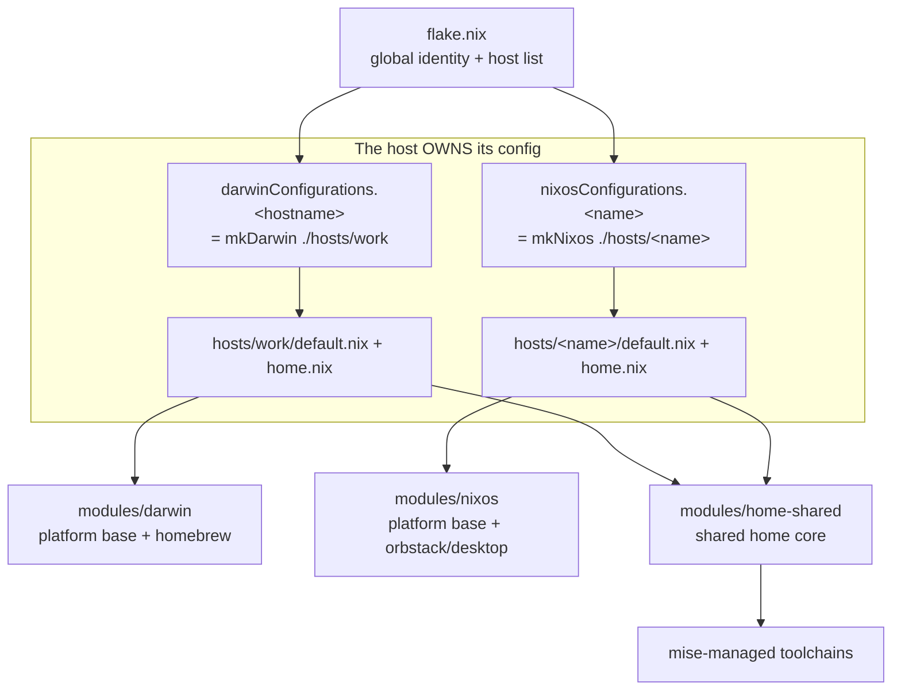

# Architecture

How a `darwin-rebuild` / `nixos-rebuild` turns the files in this repo into a system.

## Data flow

## The layers

1. **Hosts** (`hosts/<name>/`) — each machine OWNS its config: `default.nix` (system)
   sets `nixpkgs.hostPlatform` + `networking.hostName` + machine-specific config and
   imports the reusable pieces it wants; `home.nix` sets its `hn.*` toggles + host
   home. See [`../hosts/AGENTS.md`](../hosts/AGENTS.md).

2. **Builders** (`lib/mk-system.nix` + `lib/mk-home.nix`) — turn a host directory into
   a darwin/nixos configuration, adding the platform base + shared home core. Identity
   is global in `flake.nix`, threaded to every module as `userConfig`.

3. **Modules** — the reusable layers a host imports:
   - macOS platform: [`../modules/darwin`](../modules/darwin) (nix-darwin defaults +
     the Homebrew base).
   - Linux platform: [`../modules/nixos`](../modules/nixos) (base + `orbstack/`,
     `desktop/` a host can import).
   - User env: [`../modules/home-shared`](../modules/home-shared), on every host; each platform's
     `home/` adds OS-only extras. Runtimes come from **mise**, not nix.

## Why this shape

- **Each host owns its 10%**: open `hosts/<name>/` to see everything unique to that
  machine; the reusable layers stay in `modules/`. Adding a machine is a new
  `hosts/<name>/` dir + one line in `flake.nix`.
- **Homebrew is complementary, not a fallback**: GUI apps live in casks (nix-homebrew
  manages the Homebrew install itself); CLI tools live in nix. `cleanup = "zap"`
  keeps the cask set exactly equal to what's declared.
- **mise over global nix for runtimes**: language versions resolve at `mise install`
  time (network), decoupled from the nix build, so per-project `.mise.toml` pins work
  without rebuilding the system.

See [`refactor-plan.md`](refactor-plan.md) for the roadmap of planned changes.
