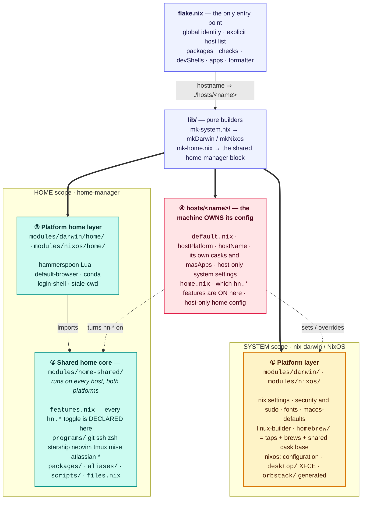

# Architecture

How a `darwin-rebuild` / `nixos-rebuild` turns the files in this repo into a system.

## The rule: each machine owns its config

Everything unique to a machine lives in `hosts/<name>/`. Everything reusable lives in layers
under `modules/` that the machine composes. There is no "global config with per-host exceptions":
a host is the only place a per-machine decision can live.

`flake.nix` holds two things: the **global identity** (one user, passed to every module as
`userConfig`) and an **explicit host list** that maps each hostname to a directory. The rest is
composition, done by the pure builders in `lib/`.

## Layers

Each numbered layer is a directory, and each box lists what belongs in it.

```mermaid
flowchart TB
  F["<b>flake.nix</b> — the only entry point<br/>global identity · explicit host list<br/>packages · checks · devShells · apps · formatter"]
  MS["<b>lib/</b> — pure builders<br/>mk-system.nix → mkDarwin / mkNixos<br/>mk-home.nix → the shared home-manager block"]
  F -->|"hostname ⇒ ./hosts/&lt;name&gt;"| MS

  subgraph sys["SYSTEM scope · nix-darwin / NixOS"]
    P1["<b>① Platform layer</b><br/><code>modules/darwin/</code> · <code>modules/nixos/</code><br/><br/>nix settings · security and sudo · fonts · macos-defaults<br/>linux-builder · <code>homebrew/</code> = taps + brews + shared cask base<br/>nixos: configuration · <code>desktop/</code> XFCE · <code>orbstack/</code> generated"]
  end

  subgraph home["HOME scope · home-manager"]
    P3["<b>③ Platform home layer</b><br/><code>modules/darwin/home/</code> · <code>modules/nixos/home/</code><br/><br/>hammerspoon Lua · default-browser · conda<br/>login-shell · stale-cwd"]
    P2["<b>② Shared home core</b> — <code>modules/home-shared/</code><br/><i>runs on every host, both platforms</i><br/><br/><code>features.nix</code> — every <code>hn.*</code> toggle is DECLARED here<br/><code>programs/</code> git ssh zsh starship neovim tmux mise atlassian-*<br/><code>packages/</code> · <code>aliases/</code> · <code>scripts/</code> · <code>files.nix</code>"]
    P3 -->|imports| P2
  end

  H["<b>④ hosts/&lt;name&gt;/ — the machine OWNS its config</b><br/><br/><code>default.nix</code> · hostPlatform · hostName · its own casks and masApps · host-only system settings<br/><code>home.nix</code> · which <code>hn.*</code> features are ON here · host-only home config"]

  MS ==> P1
  MS ==> P3
  MS ==> H
  H -.->|"sets / overrides"| P1
  H -.->|"turns hn.* on"| P2

  classDef l0 fill:#eef2ff,stroke:#6366f1,stroke-width:1.5px,color:#1e1b4b
  classDef l1 fill:#fef3c7,stroke:#d97706,stroke-width:1.5px,color:#451a03
  classDef l2 fill:#ccfbf1,stroke:#0d9488,stroke-width:1.5px,color:#042f2e
  classDef l3 fill:#ffe4e6,stroke:#e11d48,stroke-width:1.5px,color:#4c0519
  class F,MS l0
  class P1 l1
  class P2,P3 l2
  class H l3
```

How to read the arrows: solid `==>` is a module list the builder assembles, `-->` is a real
`imports` edge, and dotted lines are the merges that make the host authoritative. The Nix module
system merges all layers at once rather than applying them in order. A shared module marks a
value `lib.mkDefault`, so a host can just assign over it.

| layer | directory | role |
|---|---|---|
| builders | `lib/mk-system.nix`, `lib/mk-home.nix` | turn a host directory into a darwin/nixos configuration; see [`lib/AGENTS.md`](../lib/AGENTS.md) |
| ① platform | `modules/darwin/`, `modules/nixos/` | nix settings, security, fonts, macOS defaults, Homebrew, Linux base / XFCE / OrbStack |
| ② shared home core | `modules/home-shared/` | shell, git, editor, CLI packages, aliases, and the `hn.*` feature registry, on every host |
| ③ platform home | `modules/darwin/home/`, `modules/nixos/home/` | OS-only home modules (Hammerspoon, default browser, …) |
| ④ host | `hosts/<name>/` | `default.nix` (system) and `home.nix` (which `hn.*` features are on); see [`hosts/AGENTS.md`](../hosts/AGENTS.md) |

## System scope vs home scope

System scope needs `sudo` and changes the machine: `/etc`, LaunchDaemons, Homebrew, macOS
defaults. Home scope runs as the user and produces files like `~/.zshrc`, `~/.hammerspoon/` and
`~/.gitconfig`. `modules/home-shared/` is deliberately platform-agnostic, so the Mac and both
Linux VMs get the same shell, git and editor setup.

## Flake outputs

| output | from | notes |
|---|---|---|
| `darwinConfigurations.<hostname>` | `mkDarwin ./hosts/<dir>` | the attr name is the hostname `darwin-rebuild` matches on |
| `nixosConfigurations.<hostname>` | `mkNixos ./hosts/<dir>` | same for `nixos-rebuild` |
| `packages`, `checks` | [`pkgs/`](../pkgs/) | the same set twice, so `nix flake check` and CI build the fetchurl pins |
| `devShells` | [`shells/`](../shells/README.md) | ad-hoc project shells |
| `apps.build-switch` | `flake.nix` | switches to the config that matches the current hostname, on either platform |
| `formatter` | `treefmt.nix` | `nix fmt` (nixfmt) |

There are two nixpkgs pins on purpose: the `-darwin` branch for macOS and `nixos-` for Linux,
both on the same 26.05 release. Each platform gets the best binary cache hit rate, and the two
never drift a release apart.

## Why this shape

- **Each host owns its 10%.** Open `hosts/<name>/` to see everything unique to that machine; the
  reusable layers stay in `modules/`. Adding a machine means one new directory and one line in
  `flake.nix`.
- **The host list is explicit.** Hosts are listed, not globbed, so creating a directory is never
  enough to start building for a machine.
- **Homebrew complements nix; it isn't a fallback.** GUI apps are casks (nix-homebrew manages
  the Homebrew install itself) and CLI tools come from nix. `cleanup = "zap"` keeps the installed
  cask set equal to what's declared.
- **mise, not global nix, for runtimes.** Language versions are resolved at `mise install` time,
  separately from the nix build, so a per-project `.mise.toml` pin works without a system rebuild.
- **Features are declared in one place.** `modules/home-shared/features.nix` declares every
  `hn.*` option and never enables one, so a host's `home.nix` reads as a short list of what that
  machine does. See [where-does-x-go.md](where-does-x-go.md#feature-registry-hn).
