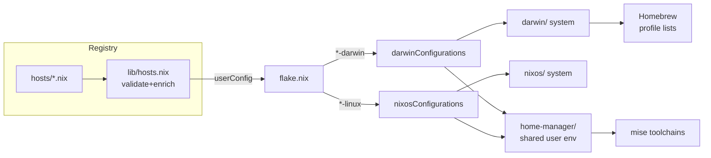
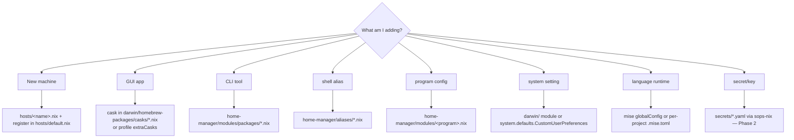

# Refactor & Enhancement Plan

> **Note:** after these phases the repo layout was reorganized into three layers —
> `hosts/` (data), `lib/` (logic), `modules/{home-shared,darwin,nixos}` (building blocks).
> Paths in this historical document reflect the *pre-reorganization* structure
> (`darwin/`, `home-manager/`, …). See [README.md](../README.md) / [AGENTS.md](../AGENTS.md)
> for the current layout.

Status: **Phases 0–5 implemented** (2026-07-11), each build-verified. Every phase
ends green on `nix build .#darwinConfigurations.KOD-ADMINs-MacBook-Pro.system`;
pure-refactor phases (1b, 2 scaffold, 3 SDK move) were verified to leave the
darwin/nixos system derivation **hash-identical**.

Done: docs + nested AGENTS.md (0); `hn.*` feature flags (1); flake DRY into
`lib/mk-system.nix`+`lib/mk-home.nix` (1b); sops-nix scaffold, inert until
`features.secrets` (2); `shells/` + exported `pkgs/` with `checks` (3); GitHub
Actions + treefmt + statix.toml (4); Atuin module + `.claude/commands/`, GC
already configured (5).

**Deferred (Phase 5, intentionally not auto-applied — disruptive/opinionated):**
- **Declarative Dock** — would rewrite the user's live Dock on rebuild; needs the
  user's desired layout first. Add as a `features.dock`-gated module later.
- **Guard-file one-time actions** — speculative; current runbook covers the manual
  steps adequately.
- **`nixpkgs-stable` escape hatch** — no current consumer; adding an unused input is
  noise. Add when a package actually needs pinning.
- **A real personal-profile host** — needs the user's second machine's facts.

Derived from a review of this repo against two reference setups:

- [bullo.sk — nix-darwin multi-host](https://bullo.sk/blog/nix-darwin-multi-host-setup/) — thin per-host stubs, parametric home-manager, agenix secrets, declarative Dock, guard files.
- [rasyidanaf — managing macOS with Nix](https://rasyidanaf.com/blog/the-nix-experience-managing-macos-with-nix/) / `tmp/darwin-dotfiles` — **options-based modules** (`rsydn.*`), `mkDarwin`/`mkNixos` builders, `shells/` devshells, exported `packages` + `checks`, SOPS secrets, MCP-NixOS + AGENTS.md.
- `tmp/dotfile-nix` — this repo's ancestor: large structured `docs/` tree, `.github/` instructions, `scripts/{install,setup,...}`.

The goal is **not** to rewrite what already works. This repo's host registry
(`hosts/` + `lib/hosts.nix` validation) and platform split are already *stronger*
than either reference (both hardcode a single `user = "..."`). The plan targets the
real gaps: option-gated modules, secrets, dev shells, exported packages, CI, and
agent-navigable docs.

---

## Assessment: keep vs. change

| Area | Verdict |
|---|---|
| `hosts/` registry + `lib/hosts.nix` validation | **Keep** — best-in-class, better than both refs |
| Platform split `darwin/` `nixos/` `home-manager/` | **Keep** |
| Homebrew profile composition (`common` + `work`/`personal`) | **Keep**, extend |
| Config-only modules (plain imports, no toggles) | **Change** → option-gated modules |
| Secrets = plain files copied by hand | **Change** → sops-nix |
| Custom `pkgs/` not exported, not build-checked | **Change** → flake `packages` + `checks` |
| Only a repo-editing devShell | **Add** → `shells/` per-project envs |
| No CI; `nix flake check` is manual | **Add** → GitHub Actions |
| `flake.nix` duplicates the whole HM wiring block twice | **Refactor** → `lib/mk-system.nix` |
| Docs: diagram only in CLAUDE.md, no per-dir agent docs | **Change** → diagrams in both + nested `AGENTS.md` |

---

## Phase 0 — Documentation & agent navigability (do first)

Lowest risk, highest immediate value, and directly what was asked for. No `.nix`
changes.

### 0.1 Architecture diagrams in both README and CLAUDE

- Keep the existing flow diagram in `AGENTS.md` (CLAUDE.md `@AGENTS.md`-imports it).
- Add a **layered** diagram + a **"where does X go?" decision diagram** (below) to
  both `README.md` and `AGENTS.md`.

**Layered view:**



**Decision diagram (put in README + AGENTS):**



### 0.2 Nested `AGENTS.md` in complicated directories

Drop a short `AGENTS.md` (checked in) in each non-obvious directory. Each states:
what lives here, what to edit vs. never touch, and the one gotcha. Priority dirs:

- **`nixos/orbstack/AGENTS.md`** — "GENERATED by OrbStack, copied verbatim. Do not
  hand-edit; re-sync from the VM's `/etc/nixos` and diff. Only `nixos/configuration.nix`
  is hand-maintained."
- **`home-manager/modules/AGENTS.md`** — the atlassian trio is the trap: explain
  `atlassian-sdk.nix` (nix-pinned SDKs at stable paths), `atlassian-mise.nix`
  (branch→Java/SDK git hooks, `NEW_STACK_PATTERN`), `maven.nix`. Note the
  `isDarwin` guards.
- **`darwin/homebrew-packages/AGENTS.md`** — "lists only, no logic; composed by
  `darwin/homebrew.nix`; `cleanup=zap` deletes anything unlisted."
- **`darwin/profiles/AGENTS.md`** — `mkProfile` extra*/remove* semantics.
- **`pkgs/AGENTS.md`** — fetchurl-pinned custom derivations; how to bump hashes.
- **`lib/AGENTS.md`** — the validation contract (required attrs, allowed profiles/systems).

Keep `AGENTS.md` as the single source of agent truth (CLAUDE.md already
`@AGENTS.md`-imports it — good; keep that, don't duplicate).

### 0.3 Split `docs/` into a small tree

Follow the ancestor's shape but stay lean:

```
docs/
  onboarding.md          # existing human runbook (keep)
  architecture.md        # NEW: the diagrams + data-flow narrative, deep version
  refactor-plan.md       # THIS file
  runbooks/
    add-a-host.md         # NEW
    add-a-package.md      # NEW
    secrets.md            # NEW (after Phase 2)
    rebuild-and-rollback.md
```

---

## Phase 1 — Option-gated modules (architectural core)

Today modules are plain imports: everything is on for everyone. The biggest
structural upgrade (straight from rasyidanaf's `rsydn.*`) is a **local option
namespace** so features become per-host toggles. Pick a namespace, e.g. `hn.*`.

**Before** (`home-manager/modules/hammerspoon.nix`): unconditional config.
**After:**

```nix
{ config, lib, pkgs, ... }:
let cfg = config.hn.hammerspoon; in {
  options.hn.hammerspoon.enable =
    lib.mkEnableOption "Hammerspoon copy/paste sounds" // { default = pkgs.stdenv.isDarwin; };
  config = lib.mkIf cfg.enable { /* existing config */ };
}
```

Then wire host intent through `userConfig`. Add an optional `features` set in
`hosts/*.nix`, validated in `lib/hosts.nix`, e.g.:

```nix
# hosts/work.nix
features = { atlassian = true; hammerspoon = true; };
```

and in the flake's HM block: `hn = userConfig.features or {};`.

**Candidates to gate:** `hammerspoon`, `atlassian-sdk`/`atlassian-mise`/`maven`
(work-only), `default-browser`, `win-tunnel` aliases, `linux-builder`. This lets a
future personal Mac drop all the Atlassian/KOD tooling with one flag instead of
forking modules.

Convert incrementally — one module per commit, `nix build` between each.

## Phase 1b — DRY the flake

`mkDarwinConfiguration` and `mkNixosConfiguration` duplicate the entire
`home-manager = { useGlobalPkgs … users.${username} … }` block. Extract:

```
lib/mk-home.nix     # the shared home-manager wiring, param: {entry, homePrefix}
lib/mk-system.nix   # wraps darwinSystem / nixosSystem, calls mk-home
```

`flake.nix` outputs shrink to a map over `darwinHosts` / `nixosHosts`. Net: ~60
fewer duplicated lines, one place to change HM options.

---

## Phase 2 — Secrets with sops-nix

Both references treat this as table stakes; this repo currently tells users to
"copy SSH keys from the old machine" (`docs/onboarding.md`). That's the largest
functional gap.

- Add input `sops-nix` (`inputs.sops-nix.url = "github:Mic92/sops-nix"`), follows nixpkgs.
- Age key at `~/.config/sops/age/keys.txt` (per machine, out of git).
- `secrets/` dir with `*.sops.yaml`; wire via `sops.secrets.<name>` in a new
  `home-manager/modules/secrets.nix` (or `darwin/`), rendered to
  `~/.config/secrets/` or directly to `~/.ssh/`.
- **Migrate:** the SSH private keys referenced in `home-manager/modules/ssh.nix`
  (`kod-work.pem`, `hahunavth`, `hahunavth_claude`), plus any tokens (z.ai-style
  gateway if added). Choose **sops-nix over agenix** — YAML is friendlier for the
  mixed key/token content here and matches the closest reference.
- Update `docs/onboarding.md` + new `docs/runbooks/secrets.md`: the only manual
  step becomes "place your age key," not "copy N key files."

Note: SDK keys/binaries live in the read-only nix store; secrets must render to a
writable path — keep the existing `MAVEN_OPTS` note in mind.

---

## Phase 3 — Dev shells + exported packages

### 3.1 `shells/` per-project environments (rasyidanaf's `importShell`)

You do Atlassian-plugin (Java 8/17 + SDK), Node/pnpm, and Python/conda work. Give
each a reproducible `nix develop .#<name>`:

```
shells/
  default.nix       # current repo-editing tools (nixfmt, statix, deadnix, nil)
  atlassian.nix     # JDK + maven wrapper env (complements mise pins)
  node.nix
  python.nix
```

Flake `devShells` maps over them via an `importShell` helper. Complements mise
(mise = version pinning; devshell = ad-hoc reproducible entry) — document the
boundary so it doesn't become "yet another way to do the same thing."

### 3.2 Export `pkgs/` + build-check them

`pkgs/{raycast-beta,atlassian-plugin-sdk}` are consumed internally but never
exported or validated. Add `pkgs/default.nix` aggregating them, wire into the
flake:

```nix
packages = forAllSystems (pkgs: import ./pkgs { inherit pkgs; });
checks   = forAllSystems (pkgs: { inherit (self.packages.<sys>) raycast-beta; });
```

so `nix flake check` fails loudly when an upstream URL/hash rots — today a broken
`fetchurl` only surfaces at rebuild time.

---

## Phase 4 — CI & quality gates

- **`.github/workflows/check.yml`**: on PR run `nix flake check`, `nix fmt --
  --check`, and `nix build .#darwinConfigurations.<host>.system --dry-run`. Use
  `DeterminateSystems/nix-installer-action` + `magic-nix-cache`. Darwin closure
  needs a `macos-latest` runner; NixOS closure builds on `ubuntu-latest`.
- **`treefmt-nix`** so `nix fmt` covers shell scripts + markdown too, not just
  `.nix`.
- Optional **pre-commit** (statix/deadnix/nixfmt) via `git-hooks.nix`.
- Keep `flake.lock` git-tracked (already a documented invariant).

---

## Phase 5 — Enhancements / new capabilities

Ordered by value-for-effort. Each is independent — cherry-pick.

1. **Declarative Dock** (bullo.sk) — a `darwin/dock.nix` using `dockutil` activation
   that diffs desired vs actual. Currently Dock is only partially set via
   `macos-defaults.nix`.
2. **Guard-file one-time actions** (bullo.sk) — formalize the "first-switch GUI
   prompt" steps (Arc default browser, Input Source Pro) as idempotent activation
   scripts writing sentinels under `~/.config/nix-darwin/`, replacing manual runbook
   steps where possible.
3. **Atuin** — cross-machine shell-history sync (Mac ↔ OrbStack VM ↔ future hosts).
   Cheap win once >1 host is live.
4. **`nixpkgs-stable` escape hatch** (rasyidanaf) — a second pinned nixpkgs for
   packages currently broken on the release branch; expose via overlay/specialArgs.
5. **A personal profile host** — exercise the profile system end-to-end (proves the
   Phase 1 feature flags actually decouple KOD tooling).
6. **AI-agent tooling for this repo** — a `.claude/` with repo skills (`/rebuild`,
   `/add-cask`, `/add-host`) and a nix-specialist subagent that always consults the
   `nixos` MCP server. Mirrors the reference `pi/` agent dir but scoped to CC.
7. **`nix-darwin` app-store/`mas` audit** and **weekly GC already covered** — verify
   `nix-settings.nix` GC schedule matches the "GC is essential" warning from both
   posts.

---

## Suggested sequencing

```
Phase 0 (docs)         ── 1 session, no build risk, ships the requested diagrams+agent docs
Phase 1 (options)      ── incremental, 1 module/commit
Phase 1b (flake DRY)   ── alongside Phase 1
Phase 2 (sops-nix)     ── standalone, unblocks clean machine setup
Phase 3 (shells+pkgs)  ── standalone
Phase 4 (CI)           ── after 3 so checks are green
Phase 5 (enhancements) ── ongoing, pick per need
```

Each phase ends green on `nix build .#darwinConfigurations.KOD-ADMINs-MacBook-Pro.system`
and `nix build .#nixosConfigurations.nixos.config.system.build.toplevel --dry-run`.
