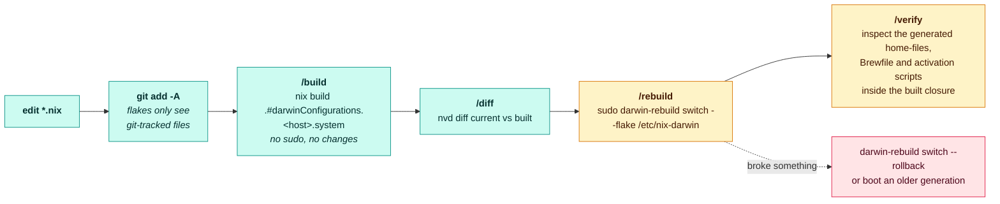

# Runbook: rebuild & rollback



The `/…` names are repo slash commands in [`.claude/commands/`](../../.claude/commands/), plus the
`verify` skill in `.claude/skills/`.

## Build only (no changes, no sudo)

Always do this before switching:

```bash
nix build .#darwinConfigurations.KOD-ADMINs-MacBook-Pro.system   # macOS
nix build .#nixosConfigurations.nixos.config.system.build.toplevel --dry-run  # Linux eval
```

## Apply

```bash
# macOS
sudo darwin-rebuild switch --flake /etc/nix-darwin
# after the first switch, the `rebuild` alias runs exactly this

# Linux (inside the OrbStack VM)
orb -m nixos sudo nixos-rebuild switch --flake /private/etc/nix-darwin#nixos
```

Run `darwin-rebuild` as your user (not a root shell) so `flake.lock` doesn't become
root-owned.

## Preview a switch

```bash
nix build .#darwinConfigurations.KOD-ADMINs-MacBook-Pro.system
nvd diff /run/current-system ./result   # packages added/removed/changed
```

Homebrew casks don't show up in `nvd`. To compare them, diff the generated Brewfiles (see `/diff`).

## Any host, by hostname

```bash
nix run .#build-switch   # darwin-rebuild or nixos-rebuild for this machine's hostname
```

## Rollback

nix-darwin/NixOS keep every generation:

```bash
darwin-rebuild --list-generations
sudo darwin-rebuild switch --rollback          # previous generation
# or boot an older generation from the boot picker (NixOS)
```

## Gotchas

- **`git add -A` first** — flakes ignore untracked files; a new module is invisible
  until staged.
- **`--impure` demanded** → `flake.lock` must be git-tracked and user-owned; do not
  pass `--impure`.
- **Some settings need logout/restart** — most `system.defaults`, Dock/Finder, and
  input-source changes don't apply from a rebuild alone.
