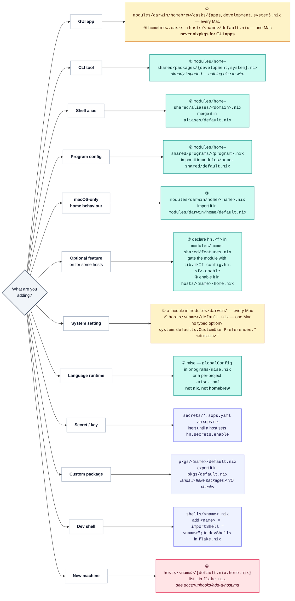

# Where does X go?

Each leaf below names the file to create or edit, plus the second file you have to wire it into.
The circled numbers are the layers from [architecture.md](architecture.md#layers).

Step-by-step versions: [add a package](runbooks/add-a-package.md), [add a host](runbooks/add-a-host.md),
[add a NixOS host](runbooks/add-nixos-host.md), [secrets](runbooks/secrets.md).

## Feature registry (`hn.*`)

Options are declared in [`modules/home-shared/features.nix`](../modules/home-shared/features.nix),
and a host opts in from its own `hosts/<name>/home.nix`. Consuming modules are gated with
`lib.mkIf config.hn.<f>.enable`, so a feature that's off adds nothing to the closure.

| option | default | what it turns on |
|---|---|---|
| `hn.hammerspoon` | on (macOS) | Lua automation; sub-toggles are declared in `features.nix` |
| `hn.defaultBrowser` | on (macOS) | sets the per-user http/https handler on activation |
| `hn.atlassian` | off | Atlassian Plugin SDK + branch-based mise/Java switching |
| `hn.homelabTunnel` | off | socat port-forward aliases to the homelab over Tailscale |
| `hn.remoteDocker` | off | Docker CLI with no local engine, plus remote contexts over SSH |
| `hn.staleCwdRecovery` | off | repairs a shell whose cwd vanished when a volume was unplugged |
| `hn.secrets` | off | sops-nix age-encrypted secrets |
| `hn.atuin` | off | Atuin shell history (Ctrl-R search, optional sync) |

Adding one takes three steps:

1. Declare the option in `features.nix`.
2. Gate the module with `lib.mkIf config.hn.<f>.enable`.
3. Enable it in the host: `hn.<f>.enable = true;`.

Outside `hn.*`: `nix.linux-builder` is on by default on darwin
([`modules/darwin/linux-builder.nix`](../modules/darwin/linux-builder.nix)), and `hosts/macbook`
turns it off.
